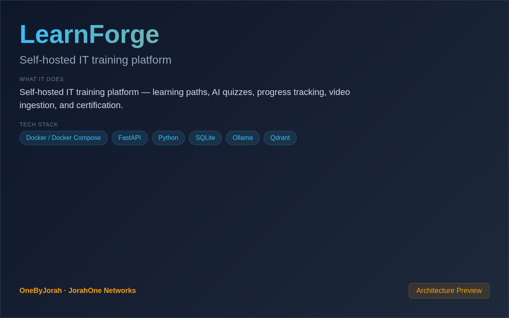

<div align="center">


# LearnForge

Self-hosted IT training platform


</div>

---

<p align="center">
  
</p>

<br>

---

## 📸 Screenshot

This is a CLI/backend-only tool. No screenshots available.

## ✨ Features

- **Learning Paths** — Structured IT training curricula
- **Automated Quizzes** — AI-generated quiz synthesis with Ollama
- **Progress Tracking** — Monitor trainee progress and completion
- **Video Ingestion** — Training media ingestion via MinIO
- **Semantic Search** — Qdrant vector search for training content
- **Telegram Bot** — Notifications and interaction
- **FastAPI Backend** — Modern, async Python backend

## 🚀 Quick Start

```bash
git clone https://github.com/OneByJorah/LearnForge.git
cd LearnForge
cp compose.env.example .env
docker-compose up -d
```

API available at **http://localhost:8080**.

## 🏗️ Architecture

```
LearnForge/
├── api/                       # FastAPI backend
├── db/                        # SQLite schema definition
├── ops/                       # Operations & deployment
├── scripts/                   # Utility scripts
├── skills/                    # Hermes agent skills
├── docs/                      # Documentation
├── docker-compose.yml         # Deployment
├── Makefile                   # Build automation
└── README.md
```

## 🛠️ Tech Stack

| Component | Technology |
|-----------|------------|
| Backend | Python, FastAPI, SQLAlchemy |
| Database | SQLite (PostgreSQL upgrade path) |
| Vector Store | Qdrant |
| Object Storage | MinIO (S3-compatible) |
| LLM | Ollama |
| Notifications | Telegram Bot |
| Agents | Hermes AgentOS |
| Deployment | Docker Compose |

## 📄 License

MIT © Jhonattan L. Jimenez

---

## 🤝 Contributing

See [CONTRIBUTING.md](CONTRIBUTING.md). All contributions follow the [Code of Conduct](CODE_OF_CONDUCT.md).

## 🔒 Security

Found a vulnerability? Please follow our [Security Policy](SECURITY.md) and report privately to `security@jorahone.com`.

## 📄 License

[MIT License](LICENSE) © Jhonattan L. Jimenez (OneByJorah)

---

<p align="center">Built with 🌴 by <a href="https://github.com/OneByJorah">OneByJorah</a> · <a href="https://jorahone.com">jorahone.com</a></p>
